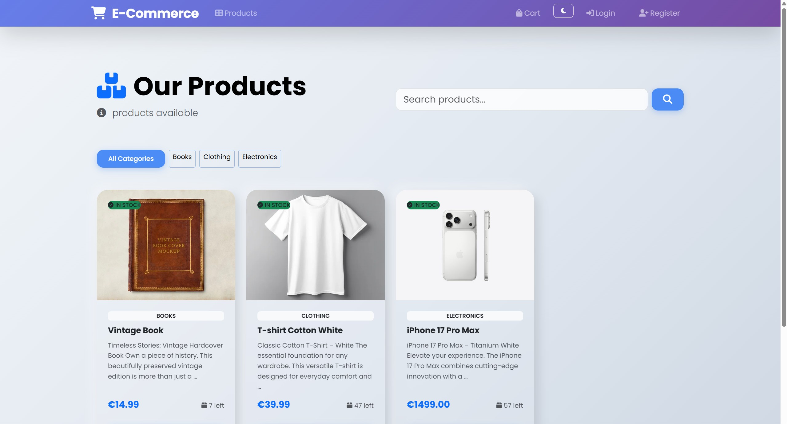
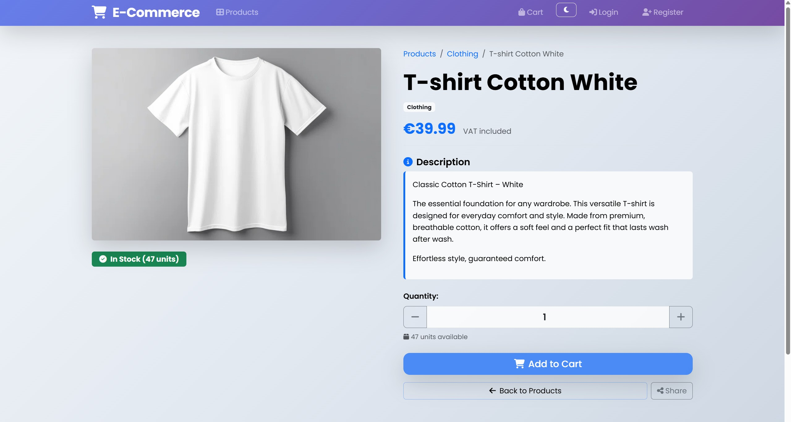
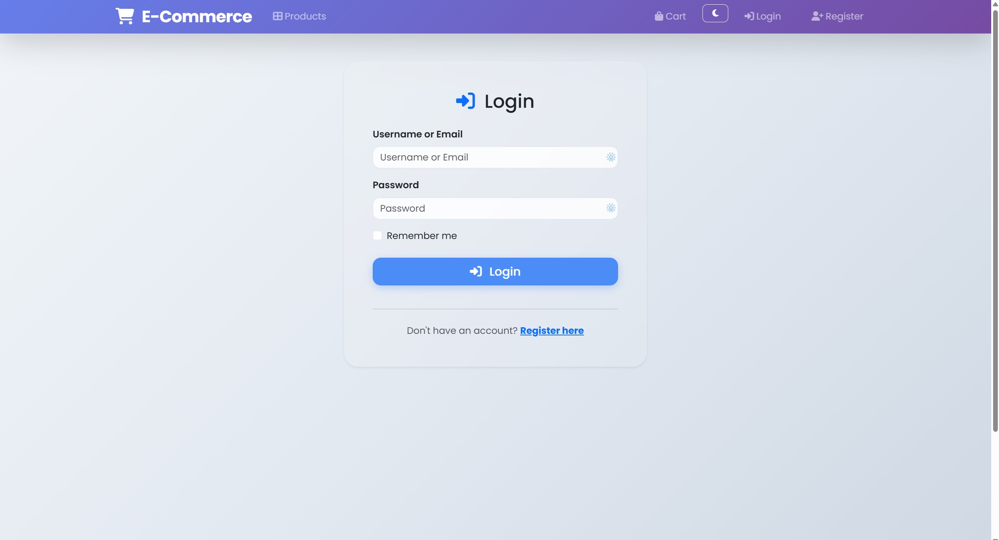
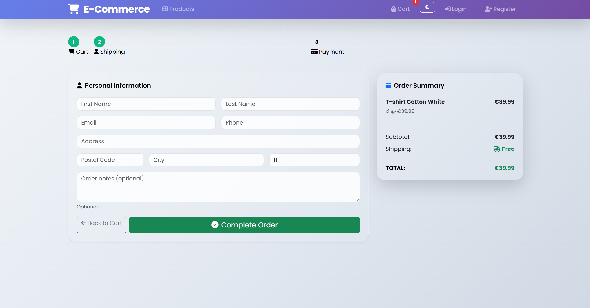
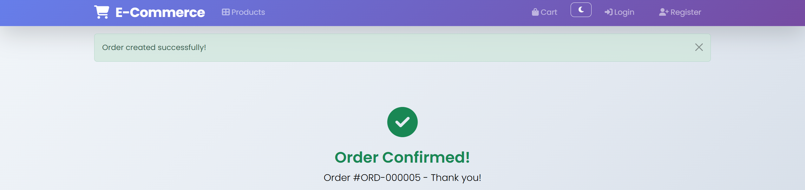

# Django E-Commerce Platform

Complete Django e-commerce platform with product catalog, cart, orders, and admin management. Production-ready with responsive design, authentication, and advanced admin features.

## Key Features

**Frontend (Customer)**
- Browse products with search & categories
- Product details with images & stock info
- Shopping cart (add/remove/update quantities)
- Anonymous checkout + user registration/login
- Order confirmation & history

**Admin Panel**
- Full CRUD for products & categories
- Customer & order management
- Inline editing, filters, search
- Stock & availability tracking

**Technical**
- Responsive Bootstrap design + custom
- Session-based cart
- Image uploads (Pillow)
- Pagination & validation

## Application Flow

**Customer Journey**
1. Visit homepage → browse `/products/`
2. Click product → view details page `/products/<slug>/`
3. Add to cart → stored in session
4. Modify quantities in cart view
5. Proceed to checkout `/checkout/`
6. Enter shipping info (anonymous) or use saved profile (logged in)
7. Create order → see confirmation page with order number

**Admin Journey**
1. Login at `/admin/` with superuser credentials
2. Manage products: add, edit, delete (inline price/stock updates)
3. Organize categories: create and structure product groups
4. Monitor customers: view profiles, order history
5. Track orders: see status, line items, customer details
6. Use filters & search for quick data lookup

## How It Works

**Session-Based Cart**
- Products added to cart stored in browser session (no login required)
- Cart persists during user's browsing session
- Survives page refreshes, lost on browser close

**Order Processing**
1. Customer submits checkout form with shipping details
2. Order created with current cart items
3. Each product snapshot captured (price fixed at purchase time)
4. Stock checked and validated
5. Order history available for registered users

**Product Management**
- Categories organize products
- Each product has: name, description, price, image, stock level
- Search & filters by category/availability
- Slug-based SEO-friendly URLs

## Project Structure

```
ecommerce_v2/
├── ecommerce/              # Django configuration (settings, urls, wsgi)
├── shop/                   # Main app
│   ├── admin/              # Admin interface (modularized)
│   │   ├── category_admin.py
│   │   ├── customer_admin.py
│   │   ├── order_admin.py
│   │   └── product_admin.py
│   ├── forms/              # Form classes
│   │   ├── auth.py         # Login/Register
│   │   └── checkout.py     # Checkout
│   ├── models/             # Models (modularized)
│   │   ├── category.py
│   │   ├── customer.py
│   │   ├── order_item.py
│   │   ├── order.py
│   │   └── products.py
│   ├── services/           # Business logic
│   │   └── cart_service.py         # CartService
│   ├── views/              # View functions (modularized)
│   │   ├── auth/
│   │   ├── cart/
│   │   ├── checkout/
│   │   ├── orders/
│   │   └── products/
│   ├── static/             # CSS & JS (modular)
│   │   └── JS/
│   │   └── img/
│   │   └── css/
│   │       ├── components/
│   │       ├── config/
│   │       ├── pages/
│   │       └── main.css
│   ├── templates/          # HTML templates
│   │   ├── auth/
│   │   ├── cart/
│   │   ├── checkout/
│   │   ├── components/
│   │   ├── orders/
│   │   ├── products/
│   │   ├── shop/
│   │   └── base.html
│   ├── migrations/         # Database migrations
│   ├── constants.py        # Centralized constants
│   ├── apps.py
│   ├── urls.py
│   └── admin.py
├── media/                  # Product images (uploads)
├── screenshot/             # Screenshots for documentation
├── manage.py               # Django management script
├── db.sqlite3              # SQLite database (development)
├── .gitignore
├── README.md
└── requirements.txt
```

---
## Screenshot dell’applicazione

### Products


### Product


### Login


### Register


### Cart


### Checkout


### Order Confirmed


## Quick Setup

```bash
git clone https://github.com/ramo2594/ecommerce_v2.git
cd ecommerce_v2
python -m venv venv && source venv/bin/activate  # Windows: venv\Scripts\activate
pip install -r requirements.txt
python manage.py migrate
python manage.py createsuperuser
python manage.py runserver
```

**Access:**
- Frontend: http://127.0.0.1:8000/
- Admin: http://127.0.0.1:8000/admin/

## Main Routes

### Public Routes
```
/                          Homepage
/products/                 Product list with filters
/products/<slug>/          Product detail view
/cart/                     Shopping cart
/checkout/                 Order checkout form
/register/                 User registration
/login/                    User login
/logout/                   User logout
```

### Admin Routes
```
/admin/                    Admin dashboard
/admin/shop/product/       Manage products
/admin/shop/category/      Manage categories
/admin/shop/customer/      Manage customers
/admin/shop/order/         Manage orders
/admin/auth/user/          Manage users
```

## Features Breakdown

### Constants (`constants.py`)
Centralized configuration for:
- **Order Statuses**: pending, confirmed, shipped, delivered, cancelled
- **Validation Limits**:
- **Field Lengths**:
- **Upload Paths**: `products/%Y/%m/` (organized by date)

### Modularized Admin
Each model has dedicated admin configuration:
- Inline editing, filters, search, fieldsets
- Prepopulated slugs for SEO
- Custom list displays for each model

### Business Logic (`services/`)
- `services/cart_service.py` → CartService with add, remove, update, get_total, clear

### Modular Styling (`static/css/`)
- `components/` → buttons, cards
- `config/` → variables
- `pages/` → cart, checkout, orders, products styles
- `main.css` → entry point

## Technical Stack

- **Backend**: Django 4.2+
- **Database**: SQLite (development) / PostgreSQL (production)
- **Authentication**: Django User model
- **Image Processing**: Pillow
- **Frontend**: Bootstrap 5 + custom CSS
- **Forms**: Django Forms with validation

### Development
```bash
python manage.py runserver
```

## Author

ramo2594